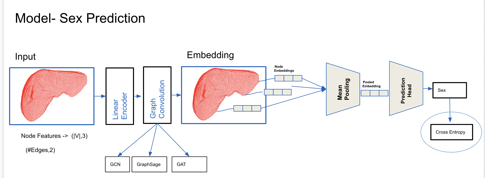
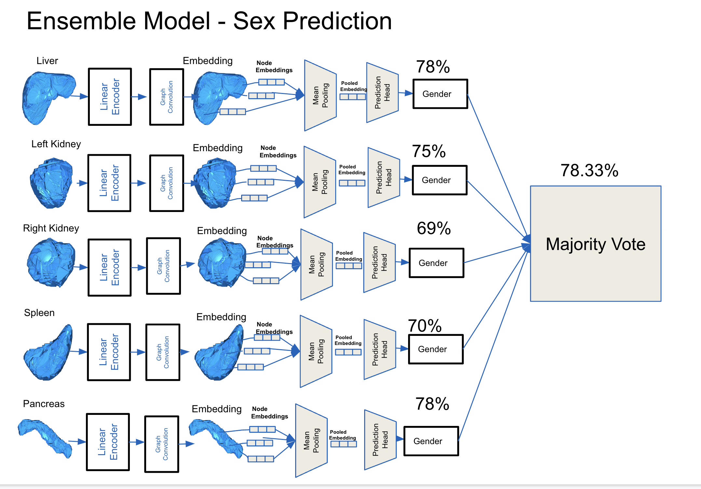

Graph Neural Networks on Abdominal Organs
==============================

Explore performance of Graph Neural Networks on the organ mesh dataset on the downstream tasks
- Sex Classification
- Age Regression
- Weight Regression
- Height Regression
- BMI Regression


# Setup

To make it easy for you to get started with our model, here's a list of recommended next steps:

- [ ] Clone this repository into a local folder.
```

cd local/path
git clone https://gitlab.lrz.de/caghankoksal/organ-mesh-registration-and-property-prediction
```
- [ ] Setup the python virtual environement using `conda`.

```
module load python/anaconda3
cd environments 
conda env create -f open3d_model_env.yaml

```

# Model Architecture
We have used different 3 different graph convolutions.
- GCN
- GraphSAGE
- GAT 
<p> A simplified overview of our model architectures is given in the following figures :

### Baseline Sex Prediction Model:


### Ensemble Sex Prediction Model
All organ specific models are used and majority voting algorithm is used.



# Hyperparameter search with Wandb Sweeps
Initialize Sweep project from sweep_config.yaml file 
```
wandb sweep --project sweeps_mesh sweeps_config.yaml 
```
Set the gpu by using CUDA_VISIBLE_DEVICES and use the sweep_ID that is generated in previous command.
```
CUDA_VISIBLE_DEVICES=0 wandb agent sweep_ID
```

# Results
For sex prediction we have used accuracy as an evaluation metric.
For regression tasks, mean average error is used as an evaluation metric.
<p> Our results given in the following figures :

### BMI, Weight, Height Regression Results :


- [ ] Check the playground notebooks for usage examples

